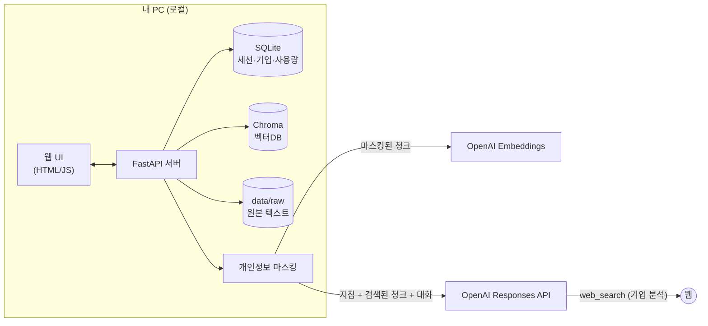

# ResumeAssistant — 자기소개서 작성 도우미 (로컬 RAG + OpenAI)

내 이력서·포트폴리오·노션 기록 같은 **실제 경험 자료를 RAG로 참고**하고, **기업·JD별로 자동 생성한 맞춤 프롬프트**를 적용해 자기소개서를 작성·첨삭하는 **로컬 웹 애플리케이션**입니다.

- 모든 데이터(원본 파일, 벡터DB, 대화 기록)는 **내 PC에만 저장**됩니다.
- OpenAI로 보내기 전에 **개인정보를 자동으로 마스킹**합니다.
- API 사용 비용을 **실시간으로 추정해 표시**합니다.
- 별도 DB 서버나 Node.js 없이 **Python 하나로 실행**됩니다. 비용은 OpenAI API 사용료만 듭니다.
- 처음 실행하면 **튜토리얼**(구조·안전성·비용·사용법)과 **초기 설정 화면**이 차례로 떠서, API 키 발급부터 `.env` 저장까지 웹에서 안내합니다.

> ⚠️ **API 사용 비용은 본인 부담입니다.** 이 프로그램은 무료(MIT)지만 AI 기능을 쓸 때마다 발생하는 OpenAI API 요금은 입력한 API 키 소유자의 계정으로 청구됩니다. 모델 선택과 사용량에 따라 비용이 달라지니 [OpenAI Limits](https://platform.openai.com/settings/organization/limits)에서 사용 한도를 설정해 두세요.

---

## 목차

1. [주요 기능](#주요-기능)
2. [동작 구조](#동작-구조)
3. [기술 스택](#기술-스택)
4. [설치 및 실행](#설치-및-실행)
5. [초기 설정 화면 (.env 웹 편집)](#초기-설정-화면-env-웹-편집)
6. [환경 변수 (.env)](#환경-변수-env)
7. [사용 가이드](#사용-가이드)
8. [프롬프트 엔지니어링 설계](#프롬프트-엔지니어링-설계)
9. [RAG 설계](#rag-설계)
10. [개인정보 보호](#개인정보-보호)
11. [비용 추적](#비용-추적)
12. [프로젝트 구조](#프로젝트-구조)
13. [REST API](#rest-api)
14. [문제 해결](#문제-해결)
15. [한계 및 향후 계획](#한계-및-향후-계획)
16. [라이선스](#라이선스)

---

## 주요 기능

### 📘 튜토리얼
- 처음 실행하면 가장 먼저 표시됩니다. 이후에는 메뉴 맨 위에서 언제든 다시 볼 수 있습니다.
- **⚠️ 비용 안내**
  - API 비용이 본인 부담이라는 점을 강조합니다.
  - 현재 설정 기준으로 작업별 예상 비용(초안, 첨삭, 기업 분석, 자료 등록)을 보여줍니다.
  - 작성 모델별 1회 비용을 비교하고(참고용), OpenAI 한도 설정 방법을 안내합니다.
- **🏠 구조와 안전성**: 모든 것이 내 PC에서 동작한다는 구조도, API 키와 개인 자료가 안전한 이유, 데이터별 저장 위치와 전송 여부 표
- **📄 페이지별 가이드**: 초기 설정, 자료 관리, 기업 분석, 작성, 사용량의 기능과 사용 방법, 팁
- 추천 사용 흐름, 자주 묻는 질문

### ⚙️ 초기 설정 (웹에서 .env 편집)
- `.env`가 없거나 API 키가 설정되지 않은 상태로 실행하면 **초기 설정 화면이 먼저 열립니다.** 상단 경고 배너와 메뉴의 빨간 점도 함께 표시됩니다.
- 설정은 4단계로 진행합니다: **① API 키 → ② 모델 → ③ 개인정보 → ④ 비용 관리**
  - 단계마다 **키 발급 방법을 단계별로 안내**하는 가이드가 있습니다.
  - 추천값이 미리 채워져 있어, 키만 넣고 저장해도 바로 쓸 수 있습니다.
- **키 확인(무료)**: 입력한 키가 유효한지, 선택한 모델을 이 키로 쓸 수 있는지 OpenAI에 직접 확인합니다.
- **저장**하면 로컬 `.env`에 기록되고 **서버 재시작 없이 즉시 적용**됩니다.

### ✍️ 자소서 작성 (문항별 대화)
- 문항마다 **작성 세션**을 만들고 지원 기업, 문항, **최소·최대 글자수**(공백 포함), 작성 모델을 설정합니다. 최소를 비우면 최대의 90%가 하한입니다.
- 요청할 때마다 내 자료에서 관련 경험을 검색해 근거로 삼고, 답변은 **스트리밍**으로 보여줍니다.
- 빠른 요청 버튼: `초안 작성`, `소재 추천`, `더 구체적으로`, `다른 소재로`, `첨삭·평가`, `글자수 맞추기`
- 답변마다 다음 정보가 표시됩니다.
  - **본문 글자수**: 공백 포함·제외. 목표 범위를 벗어나면 색으로 경고합니다.
  - **참고한 자료**: 자료명, 분류, 유사도, 원문 일부
  - **이번 요청 비용**: USD와 KRW
- **글자수 자동 보정**: 초안이 설정한 최소~최대 범위를 벗어나면 자동으로 한 번 다시 조정합니다.
- 내가 쓴 초안을 붙여넣고 첨삭을 요청할 수도 있습니다.

### 🧩 기타 문항 작성
- 지원서의 **항목별 서술 칸**(예: 연구실적의 `주요 내용`·`직무연관성`, 경력의 `담당업무`·`퇴사 사유`)을 작성합니다.
- 입력은 세 가지입니다. 회사마다 칸이 달라도 칸 이름과 글자수만 입력하면 대응됩니다.
  - **대주제**(예: 연구실적)
  - **소주제**(예: 논문, 선택) → **이름**(예: 실제 논문명·프로젝트명·회사명)
  - **출력할 내용**(칸 이름 + 최소·최대 글자수, 여러 개 가능)
- **근거 우선순위**: ① **마스터 프로필** 항목을 검색 없이 그대로 포함 → ② RAG 검색 결과로 보충 → ③ 지원 기업을 고르면 기업 맞춤 지침 반영
  - 마스터 프로필이 없으면 RAG만으로 작성하고, 부족한 사실은 `[확인 필요]`와 보완 질문으로 표시합니다.
- 여러 항목을 **한 번에, 서로 겹치지 않게** 작성합니다(JSON 출력).
- 글자수 범위를 벗어난 항목만 자동으로 한 번 보정합니다.
- 칸별로 복사, **다시 쓰기**(방향 지시 가능, 다른 칸 내용과 중복 회피), 직접 수정 후 저장을 할 수 있습니다.
- 대주제별 추천 칸을 칩으로 제공하고, 작성 이력을 저장합니다.

### 🗂 마스터 프로필
- 지원서에 반복해서 쓰는 이력을 **대주제 → 소주제(선택) → 이름**으로 한 번만 정리합니다. 예: 연구실적 → 논문 → 'Vision Transformer 기반 결함 검출'
- 소주제는 대주제별 추천 목록을 제공합니다. 예: 연구실적 → 논문·특허·학회 발표·연구 과제, 경력 → 정규직·인턴·계약직
- 기본 대주제: 학력, 경력, 연구실적, 프로젝트, 자격증, 어학, 수상, 대외활동, 교육이수 (직접 추가 가능)
- 항목 칸: 기간, 소속·기관, 역할, 성과·수치, 기술·키워드, **상세 내용**(자유 서술), 🔒 **AI에 보내지 않는 메모**(연봉 등, AI 요청과 검색에서 항상 제외)
- **✨ 자료에서 자동 추출**: 자료 관리에 올린 이력서·논문·포트폴리오에서 AI가 항목 초안을 뽑아줍니다.
  - 추출 전에 자료를 고르면 예상 비용을 보여줍니다.
  - 자료에 적힌 사실만 추출하고, 개인정보는 마스킹해서 보냅니다. 1만 5천 자가 넘는 자료는 앞 12,000자와 끝 3,000자만 사용합니다.
  - 여러 자료에 같은 이력이 있으면 하나로 합칩니다(이름의 공백·대소문자 차이 무시).
  - 결과를 **검토 화면**에서 확인·수정하고 골라서 저장합니다. 저장 전에는 아무것도 바뀌지 않습니다.
  - 이미 있는 항목은 기본으로 **병합**합니다. 빈 칸만 채우고 상세 내용은 뒤에 덧붙이며, 직접 쓴 내용과 🔒 메모는 그대로 둡니다.
- 저장하면 **RAG에 자동 등록**됩니다(임베딩만 사용, 항목 20개에 약 0.3원). 기타 문항 작성뿐 아니라 **자소서 작성 검색에도 포함**됩니다.
  - 한 번에 참고하는 자료 조각 수(`RAG_TOP_K`)는 그대로라서 작성 비용은 늘지 않습니다.

### 🏢 기업 분석 → 맞춤 프롬프트 자동 생성
- 회사명, 직무, 채용공고(JD), **참고 URL**(인재상·채용공고 페이지), 인재상 메모를 입력하면 **API를 2단계로 호출**합니다.
  - 참고 URL은 서버가 페이지 본문을 직접 읽어 최우선으로 반영하므로, 웹 검색보다 공식 표현과 최신 정보가 정확합니다. 읽지 못한 페이지는 결과에 ⚠️로 표시됩니다.
  1. **기업 분석**: 웹 검색(선택)과 JD를 바탕으로 인재상, 직무 핵심 역량, JD 키워드, 최근 동향, 선호 톤, 작성 전략, 피해야 할 것을 JSON으로 정리합니다.
  2. **프롬프트 생성**: 분석 결과를 바탕으로 **이 기업 전용 작성 지침(시스템 프롬프트)**을 생성합니다.
- 생성된 지침은 화면에서 **직접 수정**하거나 **다시 생성**할 수 있습니다.
- 작성 세션에서 기업을 선택하면 해당 지침이 자동으로 적용됩니다.
- 웹 검색으로 참고한 **출처 링크**도 함께 저장합니다.

### 📚 자료 관리 (RAG)
- 지원 형식

  | 유형 | 방법 |
  |---|---|
  | PDF · DOCX · MD · TXT · CSV · HTML | 파일 업로드 (드래그 앤 드롭, 여러 개 동시 가능) |
  | 노션 | `내보내기 → Markdown & CSV`로 받은 **ZIP을 그대로 업로드** (중첩 ZIP 지원, 파일명 뒤 해시는 자동 제거) |
  | 포트폴리오 사이트 | URL 입력 → 본문 자동 추출 |
  | 자료에 없는 경험 | 텍스트 직접 입력 |

- 등록된 자료 목록에서 할 수 있는 일
  - **사용 켜기/끄기**: 삭제하지 않고 검색 대상에서만 빼기
  - **분류 변경**: 이력서 / 자기소개서 / 포트폴리오 / 프로젝트 / 논문 / 경험·활동 / 기타
  - **미리보기**: OpenAI로 실제 전송되는, 마스킹된 청크 확인
  - **재색인**, **삭제**
- **검색 테스트**: 문장을 넣어 어떤 자료가 검색되는지 미리 확인할 수 있습니다.
- **PDF 추출 품질 개선**: 모두 로컬에서 처리하며 API 비용이 들지 않습니다.
  - **엔진**: Chrome의 PDF 엔진(PDFium)으로 추출합니다. 결과가 나쁘면 pypdf로도 뽑아서 더 나은 쪽을 고릅니다.
  - **정제**
    - 반복되는 머리글·바닥글과 페이지 번호를 제거합니다.
    - PDF 줄바꿈으로 끊긴 문장을 잇고, 영어 하이픈 줄바꿈(`infor-`/`mation`)을 합칩니다.
    - 2단 논문을 읽기 순서대로 추출합니다.
  - **품질 검사**: 깨진 문자 비율, 텍스트 없는 페이지(스캔본), 글자 단위로 분리된 띄어쓰기를 감지합니다. 문제가 있으면 목록에 **⚠ 추출 품질** 배지로 표시합니다.

### 💰 사용량 · 비용
- 사이드바에 오늘과 이번 달의 추정 비용이 항상 표시됩니다. 월 예산을 넘으면 빨간색으로 바뀝니다.
- 대시보드에서 볼 수 있는 것
  - 오늘 / 이번 달 / 누적 비용
  - 예산 사용률
  - 최근 30일 일별 그래프
  - 기능별·모델별 비용
  - 최근 호출 30건
- `OPENAI_ADMIN_KEY`를 설정하면 **OpenAI 공식 청구 금액**(Costs API)도 함께 표시됩니다.
  - **이 앱의 API 키 금액만 따로** 보여줍니다. 조직의 프로젝트 키 목록에서 가려진 키 값(`sk-proj-****74YA`)의 앞·뒤를 대조해 이 앱이 쓰는 키의 ID를 찾고, `group_by=api_key_id`로 그 키의 비용만 합산합니다.
  - 다른 키로 쓰는 서비스까지 합친 **조직 전체 금액**도 함께 표시합니다.
  - 예전 사용자 키(프로젝트 키가 아닌 키)이거나 앞·뒤 글자가 같은 키가 여럿이면 매칭하지 않고 조직 전체 금액만 표시합니다.

---

## 동작 구조



### 자료 등록 흐름
```
파일/URL/텍스트 → 텍스트 추출 → 원본 저장(data/raw) → 청크 분할 → 개인정보 마스킹
               → OpenAI 임베딩 → Chroma에 저장(data/chroma)
```

### 작성 요청 흐름
```
사용자 요청
 ├─ ① 검색어 확장   : 문항 + 기업 인재상/키워드 + 요청 → 저가 모델이 검색어 3~4개 생성
 ├─ ② 벡터 검색     : 원 요청 + 문항 + 확장 검색어로 '사용 중'인 자료만 검색 → 중복 제거 후 상위 K개
 ├─ ③ 프롬프트 조립 : 기본 작성 지침 + 기업 맞춤 지침 + <작성 정보> + <참고자료> + 최근 대화
 ├─ ④ 스트리밍 생성 : 작성 모델 → 브라우저(SSE)
 └─ ⑤ 후처리       : '### 초안' 본문 추출 → 글자수 계산 → 범위를 벗어나면 자동 보정 요청
```

---

## 기술 스택

| 영역 | 사용 기술 |
|---|---|
| 백엔드 | Python 3.10+, FastAPI, Uvicorn |
| LLM | OpenAI **Responses API** (스트리밍, reasoning effort, web_search 도구) |
| 임베딩 | OpenAI `text-embedding-3-small` |
| 벡터DB | Chroma (로컬 파일 저장, cosine 유사도) |
| 저장소 | SQLite |
| 문서 파싱 | pypdfium2(PDFium), pypdf(예비), python-docx, trafilatura(HTML/URL 본문 추출), httpx |
| 프론트엔드 | Vanilla JS + CSS (빌드 불필요), marked, DOMPurify, Pretendard 폰트 |

---

## 설치 및 실행

### 요구 사항
- Python **3.10 이상** (3.13에서 테스트)
- OpenAI API 키 ([발급](https://platform.openai.com/api-keys))

### 빠른 시작 (macOS / Linux)

```bash
git clone https://github.com/joonhyunkim1/ResumeAssistant.git
cd ResumeAssistant
./run.sh
```

`run.sh`가 하는 일은 다음과 같습니다.
1. `.venv` 가상환경을 만들고 `requirements.txt`를 설치합니다.
2. `.env`가 없으면 `.env.example`을 복사해 만듭니다(권한 600).
3. 서버를 실행하고 브라우저에서 http://127.0.0.1:8000 을 엽니다.
4. 처음이라면 **초기 설정 화면**이 뜹니다. 안내에 따라 API 키를 발급받아 붙여넣고 **저장**하면 끝입니다.

### 수동 실행 (Windows 포함)

```bash
python -m venv .venv
# Windows: .venv\Scripts\activate   /  macOS·Linux: source .venv/bin/activate
pip install -r requirements.txt
uvicorn app.main:app --host 127.0.0.1 --port 8000
# 브라우저에서 http://127.0.0.1:8000 → 초기 설정 화면에서 키 입력
```

> 서버는 기본적으로 `127.0.0.1`(내 PC)에서만 접속할 수 있습니다. 인증 기능이 없으므로 `HOST=0.0.0.0`으로 외부에 열지 마세요.

---

## 초기 설정 화면 (.env 웹 편집)

### 동작 방식
```
브라우저(초기 설정) ──PUT /api/setup──▶ 로컬 FastAPI 서버 ──▶ 프로젝트 폴더/.env 파일 기록 (권한 600)
                                                    └──▶ settings.reload() → 재시작 없이 즉시 반영
브라우저(키 확인)   ──POST /api/setup/test-key──▶ 서버 ──▶ api.openai.com/v1/models (과금 없음)
```

### 안전장치
| 항목 | 내용 |
|---|---|
| 저장 위치 | 이 PC의 `.env` 파일에만 저장합니다. 외부 서버로 전송하지 않습니다. `.gitignore`에 포함되어 Git에 올라가지 않습니다 |
| 파일 권한 | 저장할 때마다 `600`(본인만 읽기/쓰기)으로 설정하고, 임시 파일에 쓴 뒤 교체하는 원자적 저장으로 파일 손상을 막습니다 |
| 키 노출 방지 | 저장된 키는 브라우저로 **마스킹된 값만** 돌려줍니다(예: `sk-proj…abcd`). 빈 칸으로 저장하면 기존 키를 유지합니다 |
| 입력 검증 | 키 형식(`sk-`, `sk-admin-`), 숫자 범위, 선택지를 확인합니다. 줄바꿈과 따옴표를 제거해 `.env` 인젝션을 막고, 편집 가능한 항목만 허용합니다 |
| 로컬 전용 | `Host` 헤더를 검사해 DNS rebinding을 막고, `Origin`을 검사해 다른 웹사이트에서 보낸 POST/PUT/DELETE를 거부합니다(403) |
| 기존 파일 보존 | 기존 `.env`의 주석과 순서를 유지하며 값만 교체합니다 |

> `HOST`, `PORT`, `DATA_DIR`는 서버 실행 시점에만 읽기 때문에 웹에서 편집할 수 없습니다. 바꾸려면 `.env`를 직접 수정한 뒤 재시작하세요.

### 직접 수정하고 싶다면
1. 프로젝트 폴더의 `.env`를 텍스트 편집기로 엽니다. 없으면 `.env.example`을 복사해 만듭니다.
2. `KEY=값` 형식으로 공백 없이 입력합니다.
3. 브라우저를 새로고침하면 반영됩니다. `HOST`, `PORT`, `DATA_DIR`를 바꿨다면 서버를 재시작하세요.

### OpenAI API 키 발급 요약
1. [platform.openai.com](https://platform.openai.com/)에 로그인합니다. ChatGPT Plus 구독과 API 요금은 **별개**입니다.
2. [Billing](https://platform.openai.com/settings/organization/billing/overview)에서 결제수단을 등록하고 크레딧을 충전합니다(최소 $5). 자동 충전은 꺼두기를 권장합니다.
3. [API keys](https://platform.openai.com/api-keys) → **Create new secret key** → 표시된 `sk-proj-…` 키를 복사합니다. 한 번만 표시됩니다.
4. 초기 설정 화면에 붙여넣고 **키 확인** → **저장**을 누릅니다.
5. (권장) [Limits](https://platform.openai.com/settings/organization/limits)에서 월 사용 한도를 설정합니다.

---

## 환경 변수 (.env)

모든 항목은 **웹의 초기 설정 화면**에서 편집할 수 있습니다(`HOST`, `PORT`, `DATA_DIR` 제외).

| 변수 | 기본값 | 설명 |
|---|---|---|
| `OPENAI_API_KEY` | (필수) | OpenAI API 키 |
| `OPENAI_ADMIN_KEY` | (선택) | 공식 청구 금액 조회용 Admin Key ([발급](https://platform.openai.com/settings/organization/admin-keys), 조직 Owner 권한 필요) |
| `WRITER_MODEL` | `gpt-5.6-terra` | 자소서 작성 기본 모델 (문항별로 화면에서 변경 가능) |
| `ANALYZER_MODEL` | `gpt-5.6-terra` | 기업 분석과 맞춤 프롬프트 생성 모델 |
| `UTILITY_MODEL` | `gpt-5.6-luna` | 검색어 확장 등 보조 작업용 저가 모델 |
| `EMBEDDING_MODEL` | `text-embedding-3-small` | 임베딩 모델 (바꾸면 모든 자료를 재색인해야 함) |
| `AVAILABLE_MODELS` | `gpt-5.6-terra,gpt-5.6-sol,gpt-5.6-luna,gpt-6-astra` | 작성 화면에서 고를 수 있는 모델 목록 |
| `REASONING_EFFORT` | `medium` | 추론 강도 `low` / `medium` / `high` |
| `RAG_TOP_K` | `8` | 요청 1회에 참고할 청크 수 |
| `RAG_QUERY_EXPANSION` | `true` | 검색어 확장 사용 여부 |
| `CHUNK_SIZE` / `CHUNK_OVERLAP` | `700` / `120` | 청크 길이와 겹침(문자 수) |
| `HISTORY_TURNS` | `10` | 함께 보낼 최근 대화 턴 수 |
| `PII_MASKING` | `true` | 개인정보 마스킹 사용 여부 |
| `PII_CUSTOM_TERMS` | (빈 값) | 추가로 가릴 단어(쉼표 구분). 예: `홍길동,길동` → `[지원자]` |
| `USD_KRW` | `1400` | 원화 환산 환율 |
| `MONTHLY_BUDGET_USD` | `10` | 월 예산(USD). `0`이면 표시하지 않음 |
| `HOST` / `PORT` | `127.0.0.1` / `8000` | 서버 주소 |
| `DATA_DIR` | `./data` | 데이터 저장 경로 (테스트용으로 바꿀 때 사용) |

---

## 사용 가이드

### 1단계: 자료 등록 (`📚 자료 관리`)
1. 분류를 고르고 이력서, 기존 자소서, 포트폴리오 PDF 등을 끌어다 놓습니다.
2. **노션 자료를 올리는 방법**
   1. 노션 페이지 오른쪽 위 `···` → `내보내기`를 누릅니다.
   2. 형식을 **Markdown & CSV**로 고르고, 하위 페이지 포함을 켭니다.
   3. 받은 ZIP을 **압축을 풀지 말고** 그대로 업로드합니다.
3. 포트폴리오 사이트는 `URL` 탭에 주소를 넣습니다.
4. 문서에 없는 경험(수치, 에피소드 등)은 `직접 입력` 탭으로 보충하면 초안 품질이 크게 좋아집니다.
5. `미리보기`로 마스킹이 잘 됐는지, `검색 테스트`로 원하는 경험이 검색되는지 확인합니다.

### 2단계: 기업 분석 (`🏢 기업 분석`)
1. 회사명, 직무, 채용공고 전문을 붙여넣습니다.
   - **회사 인재상 페이지나 채용공고 페이지 URL**을 참고 URL 칸에 넣으면 훨씬 정확해집니다.
2. 회사 채용 페이지의 **인재상이나 핵심가치를 메모 칸에 붙여넣으면 가장 정확합니다.** 이 내용은 최우선으로 반영됩니다.
3. `웹 검색`을 켜면 최신 인재상과 사업 동향을 조사하며, 검색 1회당 약 $0.01이 추가됩니다.
4. 생성된 **기업 맞춤 프롬프트**를 검토하고 필요하면 수정해 저장합니다.
5. `이 기업으로 새 문항`을 누르면 기업이 연결된 작성 세션이 바로 만들어집니다.

### 3단계: 작성 (`✍️ 작성`)
1. 오른쪽 패널에 **문항**과 **최소·최대 글자수**를 입력합니다. 공백 포함 기준이며, 최소를 비우면 최대의 90%가 하한입니다.
2. `소재 추천`으로 어떤 경험을 쓸지 먼저 정하고, `초안 작성`을 누릅니다.
3. 답변 끝의 **보완 질문**(`[확인 필요]`)에 답하면 수치와 디테일이 채워진 초안을 받을 수 있습니다.
4. `첨삭·평가`로 채용 담당자 관점의 점수와 약점을 받고, 반복해서 다듬습니다.
5. `초안 복사`로 제출용 본문만 복사합니다.


### 4단계: 지원서 항목 칸 (`🗂 마스터 프로필` → `🧩 기타 문항`)
1. **마스터 프로필**에 경력·연구실적 등을 항목별로 정리합니다. 선택이지만 추천합니다. **✨ 추출**을 누르면 올린 자료에서 초안을 한 번에 만들 수 있습니다.
2. **기타 문항**에서 대주제·소주제·이름을 고르고(마스터 프로필 항목은 이름 목록에서 선택하면 대주제·소주제가 자동으로 채워짐), 지원서의 칸 이름과 글자수를 입력한 뒤 **✨ 작성하기**를 누릅니다.
3. 칸마다 **복사**해서 채용 사이트에 붙여넣습니다. 마음에 들지 않는 칸은 **다시 쓰기**를 누릅니다.
---

## 프롬프트 엔지니어링 설계

모든 프롬프트는 [`app/prompts.py`](app/prompts.py) 한 파일에 모여 있어 쉽게 고칠 수 있습니다.

### 프롬프트 구성 (계층형)

| 계층 | 위치 | 내용 |
|---|---|---|
| ① 기본 작성 지침 | `WRITER_SYSTEM` (instructions) | 모든 기업에 공통인 원칙과 출력 형식 |
| ② 기업 맞춤 지침 | 기업 분석 단계에서 **API가 생성**, instructions 뒤에 덧붙임 | 이 기업·직무 전용 전략 |
| ③ 턴별 컨텍스트 | 사용자 메시지 | `<작성 정보>` 기업·직무·문항·글자수, `<참고자료>` RAG 결과(출처 표기), `<요청>` |
| ④ 대화 기록 | input | 최근 N턴 (이전 초안에 대한 수정 요청 맥락 유지) |

### 기본 작성 지침의 핵심 원칙
- **사실성**: 참고자료나 사용자 발화에 없는 경험·수치는 만들지 않습니다. 부족한 정보는 본문에 `[확인 필요: …]`로 표시하고 마지막에 질문합니다. 할루시네이션을 막는 가장 중요한 장치입니다.
- **문항 의도 우선**: 문항 유형별로 평가 역량을 매핑합니다.
  - 지원동기 → 회사·직무 이해도
  - 협업 → 갈등 조정
  - 실패 → 원인 분석과 개선 행동
- **구조**: 첫 문장에 결론을 두는 두괄식, STAR 구조로 쓰되 '행동'에 약 40%를 할애하고 '나'의 기여를 드러냅니다. 결과는 정량화하고, 마무리는 직무 기여로 연결합니다.
- **기업 맞춤**: 인재상 키워드를 나열하지 않고 행동과 결과로 증명합니다.
- **피해야 할 표현**: "어릴 적부터", 추상어만 쓰는 문장, "귀사", 같은 어미 반복, 회사 칭찬만 하는 지원동기
- **고정 출력 형식**: `### 초안` / `### 작성 포인트` / `### 보완 질문`. 서버가 초안 본문만 정확히 뽑아 글자수를 셀 수 있게 하기 위한 형식입니다.

### 기업 맞춤 프롬프트 생성 (메타 프롬프팅)
1. `COMPANY_ANALYZER`는 사용자 메모를 최우선으로 신뢰하고, 불확실한 정보는 `confidence_notes`에 남기는 **구조화 JSON**을 출력합니다. 필요하면 `web_search` 도구를 사용합니다.
2. `PROMPT_ENGINEER`는 분석 JSON과 JD 원문을 받아 **실행 가능한 지시문 형태**의 기업 전용 지침을 씁니다. 지침에는 다음 섹션이 들어갑니다.
   - 핵심 역량 우선순위
   - 인재상별 증명 방법
   - 문항 유형별 전략
   - 톤
   - 피해야 할 것

### 글자수 보정
LLM은 글자수를 정확히 세지 못합니다. 그래서 프롬프트에 최소~최대 범위를 명시하고(최대는 절대 초과 금지), **서버가 직접 센 뒤** 범위를 벗어나면 `LENGTH_ADJUST` 프롬프트로 "현재 N자 → 목표 A~B자, 약 X자 줄이기/늘리기"를 구체적인 숫자와 함께 다시 요청합니다.

---

## RAG 설계

| 항목 | 방식 |
|---|---|
| 청크 분할 | 문단 단위로 묶어 약 700자 이하로 자르고, 긴 문단은 문장 단위로 분할. 앞 청크 끝 120자를 겹쳐 문맥 유지 |
| 임베딩 입력 | `[분류] 문서명` + 청크 본문 → 분류·문서명도 검색 신호로 활용 |
| 저장 | Chroma PersistentClient, cosine 거리, 메타데이터(`doc_id`, `name`, `category`, `idx`) |
| 검색 | 원 요청 + 문항 + **LLM 확장 검색어 3~4개**로 다중 검색 → 청크별 최고 점수로 병합 → 상위 K개 |
| 필터 | `사용` 스위치가 켜진 문서만 검색 (`where doc_id $in [...]`) |
| 출처 표기 | 프롬프트에 `[번호] (분류) 문서명`으로 넣고, UI에 유사도와 원문 표시 |

---

## 개인정보 보호

| 데이터 | 저장 위치 | OpenAI 전송 여부 |
|---|---|---|
| 업로드 원본에서 추출한 텍스트 | `data/raw/*.txt` (로컬) | ❌ |
| 벡터와 청크 | `data/chroma` (로컬) | 임베딩 생성 시 **마스킹된 청크만** 전송 |
| 대화, 기업 프로필, 사용량 | `data/app.db` (로컬) | 작성 요청 시 최근 대화를 **마스킹 후** 전송 |

- **자동 마스킹 대상** ([`app/pii.py`](app/pii.py))
  - 주민·외국인등록번호 → `[주민번호]`
  - 휴대폰·유선전화 → `[전화번호]`
  - 이메일 → `[이메일]`
  - 상세주소 → `[주소]`
  - `PII_CUSTOM_TERMS`에 넣은 단어(이름 등) → `[지원자]`
- 모든 요청을 **`store=false`**로 보내 OpenAI 쪽에 응답 객체를 저장하지 않습니다.
- OpenAI 정책상 API 데이터는 기본적으로 **모델 학습에 쓰이지 않습니다.** 다만 부정 사용 모니터링을 위해 최대 30일간 보관될 수 있습니다.
- 마스킹 설정을 바꾼 뒤에는 자료별로 **재색인**하세요. 새 설정으로 다시 마스킹됩니다.
- 전부 초기화하려면 서버를 종료하고 `data/` 폴더를 삭제하면 됩니다.
- `.env`, `data/`, `data_backup_*/`는 `.gitignore`에 포함되어 있어 Git에 올라가지 않습니다.
- 백업하려면 `cp -R data data_backup_$(date +%Y%m%d)`를 실행하세요. 코드를 업데이트해도 `data/`의 기록은 그대로 유지됩니다.

---

## 비용 추적

- 모든 OpenAI 호출의 응답에 포함된 토큰 사용량(입력, 캐시 입력, 출력)과 web_search 호출 수를 기록합니다.
- 이 값에 [`app/pricing.json`](app/pricing.json)의 단가를 곱해 **실시간 추정 비용**을 계산합니다.
- 단가가 바뀌거나 새 모델을 추가할 때는 `pricing.json`만 수정하면 됩니다. 단가가 등록되지 않은 모델은 사용량 화면에 경고가 뜹니다.
- **공식 금액**(`OPENAI_ADMIN_KEY` 설정 시)은 OpenAI Costs API(`/v1/organization/costs`)로 조회합니다.
  - 일 단위로 집계되고 수 시간 늦게 반영됩니다.
  - 같은 조직의 다른 앱 사용분도 포함됩니다.

**참고 비용** (`gpt-5.6-terra` 기준 대략치)
- 자료 등록(임베딩): 문서 수십 개도 수십 원 수준
- 초안 1회 작성: 약 $0.01~0.03
- 기업 분석 1회(웹 검색 포함): 약 $0.03~0.08

---

## 프로젝트 구조

```
ResumeAssistant/
├── app/
│   ├── main.py        # FastAPI 앱, REST API 라우트
│   ├── config.py      # .env 로드, 전역 설정
│   ├── db.py          # SQLite 스키마와 헬퍼
│   ├── llm.py         # OpenAI 호출 래퍼 (Responses/Embeddings, 스트리밍, 사용량 기록)
│   ├── prompts.py     # ★ 모든 프롬프트 (작성 지침, 검색어 확장, 기업 분석, 프롬프트 생성, 글자수 보정)
│   ├── company.py     # 기업 분석 → 맞춤 프롬프트 생성 (2단계)
│   ├── writer.py      # 검색어 확장 → RAG → 스트리밍 작성 → 글자수 계산
│   ├── extra.py       # 기타 문항 작성 (마스터 프로필 우선 + RAG, 항목별 글자수 보정·다시 쓰기)
│   ├── profile.py     # 마스터 프로필 저장, RAG 자동 등록
│   ├── rag.py         # 청크 분할, Chroma 색인·검색
│   ├── ingest.py      # PDF/DOCX/MD/HTML/ZIP/URL 텍스트 추출
│   ├── pdftext.py     # PDF 추출 엔진(PDFium/pypdf), 정제, 품질 검사
│   ├── pii.py         # 개인정보 마스킹
│   ├── usage.py       # 비용 집계, 공식 Costs API 조회
│   ├── setup.py       # 초기 설정: .env 읽기/쓰기, 입력 검증, 키 확인
│   └── pricing.json   # 모델 단가표
├── static/
│   ├── index.html     # 단일 페이지 UI
│   ├── app.js         # 프론트엔드 로직 (SSE 스트리밍 포함)
│   ├── tutorial.js    # 튜토리얼 (구조·안전성·비용·페이지별 가이드)
│   ├── setup.js       # 초기 설정 화면
│   ├── profile.js     # 마스터 프로필 화면
│   ├── extra.js       # 기타 문항 작성 화면
│   └── style.css      # 라이트/다크 테마
├── data/              # (자동 생성, Git 제외) SQLite, Chroma, 원본 텍스트
├── .env.example       # 환경 변수 템플릿
├── LICENSE            # MIT
├── requirements.txt
└── run.sh             # 설치 + 실행 스크립트
```

---

## REST API

서버 실행 후 http://127.0.0.1:8000/docs 에서 Swagger UI로 확인할 수 있습니다.

| 메서드 | 경로 | 설명 |
|---|---|---|
| GET | `/api/config` | 모델 목록, 마스킹 상태 등 설정 |
| GET | `/api/setup` | 초기 설정 값 (비밀 키는 마스킹), 편집 가능 항목, 모델 단가 |
| PUT | `/api/setup` | `.env` 저장과 즉시 반영 (`{"values": {...}}`) |
| POST | `/api/setup/test-key` | API 키 유효성과 모델 사용 가능 여부 확인 (무료) |
| POST | `/api/setup/test-admin-key` | Admin 키 확인 |
| GET | `/api/documents` | 자료 목록 |
| POST | `/api/documents/upload` | 파일 업로드 (multipart, `files[]`, `category`) |
| POST | `/api/documents/url` | URL 자료 추가 |
| POST | `/api/documents/text` | 텍스트 직접 추가 |
| PATCH | `/api/documents/{id}` | 사용 여부, 분류, 이름 변경 |
| DELETE | `/api/documents/{id}` | 자료 삭제 (벡터와 원본 모두) |
| GET | `/api/documents/{id}/chunks` | 마스킹된 청크 미리보기 |
| POST | `/api/documents/{id}/reindex` | 재색인 |
| POST | `/api/search` | 검색 테스트 |
| GET | `/api/companies` | 기업 프로필 목록 |
| POST | `/api/companies/analyze` | 기업 분석과 맞춤 프롬프트 생성 |
| PUT | `/api/companies/{id}` | 프로필과 프롬프트 수정 |
| POST | `/api/companies/{id}/regenerate` | 맞춤 프롬프트 재생성 |
| DELETE | `/api/companies/{id}` | 기업 프로필 삭제 |
| GET / POST | `/api/sessions` | 작성 세션 목록 / 생성 |
| PUT / DELETE | `/api/sessions/{id}` | 세션 수정 / 삭제 |
| GET / DELETE | `/api/sessions/{id}/messages` | 대화 조회 / 비우기 |
| POST | `/api/sessions/{id}/chat` | 작성 요청 (**SSE 스트리밍**, `action`: `chat` \| `adjust_length`) |
| GET / POST | `/api/profile` | 마스터 프로필 목록 / 항목 추가 (저장 시 RAG 등록) |
| PUT / DELETE | `/api/profile/{id}` | 항목 수정 / 삭제 |
| POST | `/api/profile/extract` | 자료에서 항목 후보 추출 (`doc_ids`), 저장하지 않음 |
| POST | `/api/profile/import` | 검토한 후보 저장 (`entries[]`, 항목별 `mode`: `new` \| `merge`) |
| POST | `/api/profile/reindex` | 전체 항목 RAG 재등록 |
| GET / POST | `/api/extra` | 기타 문항 이력 / 작성 (`section`, `title`, `items[{label,min,max}]`, `company_id`, `request`) |
| GET / PUT / DELETE | `/api/extra/{id}` | 조회 / 결과 수정 저장 / 삭제 |
| POST | `/api/extra/{id}/regenerate` | 한 항목 다시 쓰기 (`label`, `instruction`) |
| GET | `/api/usage` | 추정 비용 요약 |
| GET | `/api/usage/official` | 공식 청구 금액: 이 앱 키 금액 + 조직 전체 (Admin Key 필요) |

---

## 문제 해결

| 증상 | 해결 |
|---|---|
| 상단에 "OpenAI API 키가 설정되지 않았습니다" | 왼쪽 **⚙️ 초기 설정**에서 키를 입력하고 저장 (재시작 불필요) |
| 키 확인 시 "유효하지 않은 키" | 복사할 때 앞뒤가 잘렸거나, 삭제(Revoke)된 키입니다. 새로 발급하세요 |
| 키 확인 시 "크레딧이 없거나 한도 초과" | Billing에서 크레딧을 충전하거나 Limits를 확인 |
| PDF에서 "추출된 텍스트가 거의 없습니다" | 스캔(이미지) PDF입니다. 텍스트 PDF나 DOCX로 변환해 올리세요 |
| 자료에 **⚠ 추출 품질** 배지 | 배지에 마우스를 올리면 원인이 나옵니다. **미리보기**로 확인하고, 깨진 부분은 **직접 입력**으로 보충하세요 |
| PDF 추출을 개선한 뒤 기존 자료에도 적용하고 싶음 | 원본 PDF는 보관하지 않으므로 **재색인**으로는 다시 추출되지 않습니다. 삭제 후 다시 업로드하세요 |
| URL에서 "본문을 거의 추출하지 못했습니다" | JavaScript로 그리는 페이지(SPA, 노션 공개 페이지)입니다. 브라우저에서 PDF로 저장해 업로드하세요 |
| 모델 호출 오류 (model not found 등) | 초기 설정에서 **키 확인**을 눌러 ⚠ 표시된 모델을 다른 모델로 변경 |
| 사용량 비용이 0으로 표시 | `app/pricing.json`에 해당 모델 단가 추가 |
| 기업 분석 JSON 해석 실패 | 다시 시도하거나 웹 검색을 끄고 실행 (웹 검색을 끄면 JSON 모드가 강제됨) |
| 임베딩 모델을 바꾼 뒤 검색 오류 | 벡터 차원이 달라집니다. `data/chroma`를 지우고 자료를 다시 등록하세요 |

---

## 한계 및 향후 계획

- [ ] 스캔 PDF OCR 지원 (ocrmypdf + Tesseract 한국어, 선택 설치)
- [ ] 논문 전용 고급 추출 (Docling, MIT)
- [ ] JavaScript 렌더링 페이지(SPA) 수집 (Playwright)
- [ ] Notion API 토큰 연동
- [ ] 문항별 초안 버전 관리와 비교(diff)
- [ ] 하이브리드 검색(BM25 + 벡터)과 재순위화
- [ ] 자소서 결과물 DOCX/PDF 내보내기

---

## 라이선스

[MIT License](LICENSE) © 2026 joonhyunkim1

모든 의존성은 MIT 레포와 호환되는 permissive 라이선스입니다. AGPL/GPL 의존성은 쓰지 않습니다.

| 라이선스 | 라이브러리 |
|---|---|
| MIT | fastapi, python-docx, marked |
| BSD-3-Clause | uvicorn, pypdf, httpx, python-dotenv, pypdfium2 (BSD-3 / Apache-2.0) |
| Apache-2.0 | openai, chromadb, trafilatura, python-multipart, DOMPurify (Apache-2.0 / MPL-2.0) |
| SIL OFL 1.1 | Pretendard 폰트 (CDN) |

> 하위 의존성 `tld`(trafilatura 사용)는 MPL-1.1 / GPL-2.0 / LGPL-2.1 중 선택하는 삼중 라이선스이며, 이 프로젝트는 수정 없이 사용합니다(MPL-1.1 적용).
